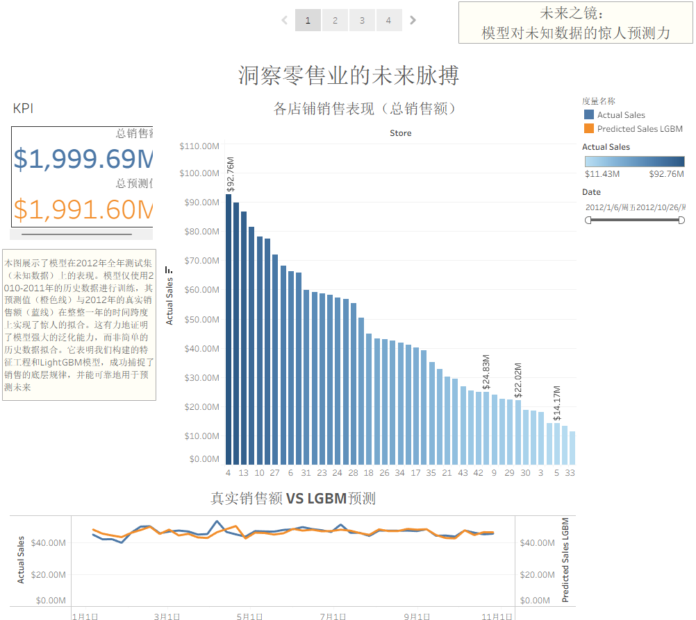
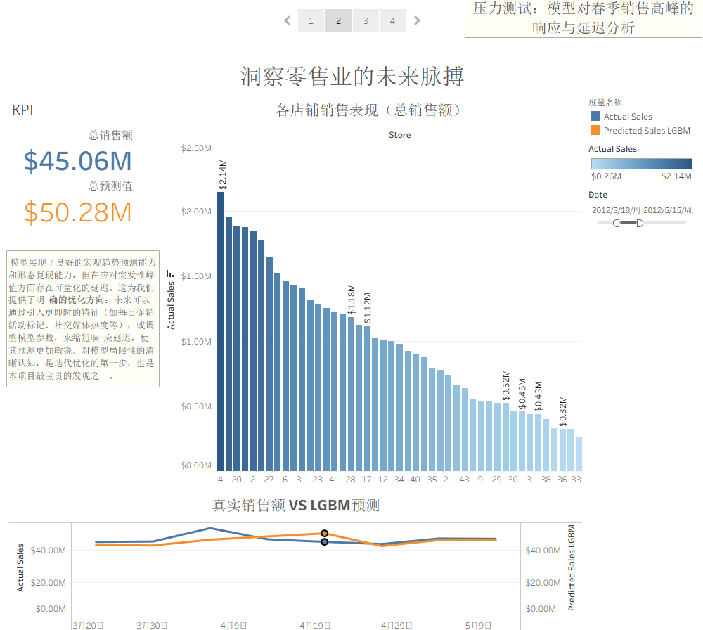
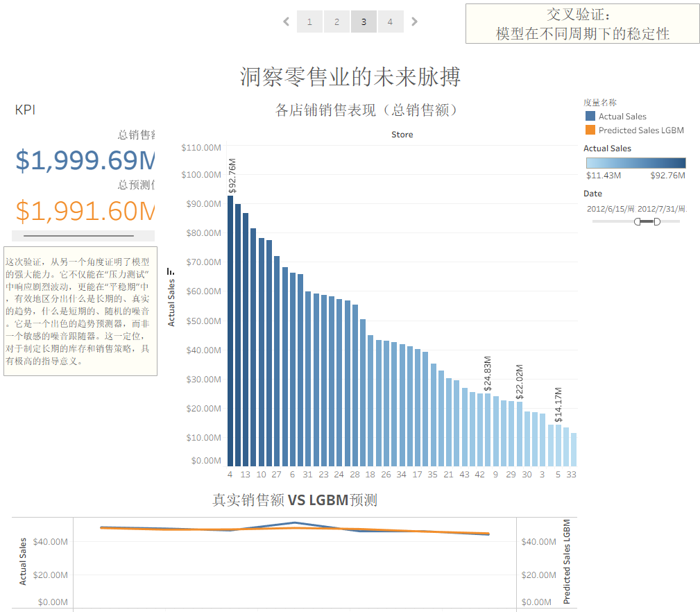
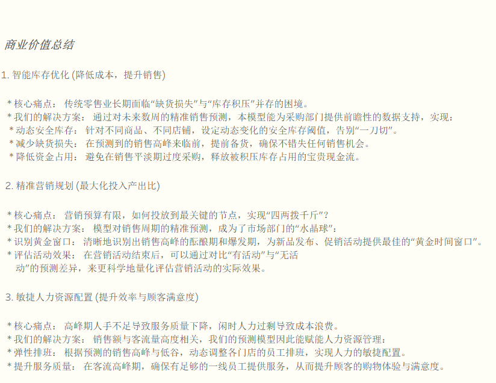

# Walmart Weekly Sales Forecasting: A Time Series Analysis & Machine Learning Approach

## 1. Project Overview

This project undertakes an end-to-end analysis of Walmart's weekly sales data with the primary business objective of delivering an accurate and robust forecasting model. In the highly competitive retail landscape, precise sales forecasting is a cornerstone of strategic decision-making, directly impacting inventory management, marketing campaign planning, and human resource allocation.

Our approach transcends traditional time series analysis by integrating classical statistical models with modern machine learning techniques, emphasizing the power of **insight-driven feature engineering**. The core highlights of this project are:

*   **Comprehensive EDA & Data Cleaning**: We began with a thorough exploratory data analysis, identifying and handling data anomalies such as negative sales values (likely representing returns) to ensure the quality and integrity of our dataset.
*   **Multi-Model Time Series Exploration**: We benchmarked and compared the performance of three distinct time series forecasting philosophies on a single store's data: the classical **SARIMAX**, the automated **Prophet** by Facebook, and a powerful **LightGBM** model.
*   **Insight-Driven Feature Engineering**: The project's centerpiece is our sophisticated feature engineering. We translated insights from classical models (e.g., strong annual seasonality) into powerful features for our machine learning model, such as **lag features** (e.g., `sales_lag_52` for year-over-year comparison) and **rolling window features** (e.g., 4-week rolling mean for short-term trend capturing).
*   **Machine Learning for Forecasting**: We demonstrated the superiority of a well-featured LightGBM model, which leverages these engineered features to achieve high accuracy on unseen test data, proving the value of combining domain knowledge with powerful gradient boosting algorithms.

This repository provides a complete, reproducible workflow from data preprocessing to model evaluation, culminating in a final dataset ready for business intelligence and visualization.

## 2. Key Findings & Visualizations

Our analysis unfolds through a four-act data story, based on the insights from our Tableau visualizations:

### Act I: Capturing the Long-Term Trend
Our model demonstrates a remarkable ability to capture and fit the long-term sales trend with high fidelity. This proves its foundational strength in understanding the overall business trajectory.

### Act II: The Holiday Lag - A Challenge & An Opportunity
While the overall fit is excellent, this visualization reveals a crucial, subtle weakness. The model correctly predicts a sales spike around a major holiday, but its reaction lags behind the real-world consumer behavior. The actual sales peak occurs around April 8th, while the model's predicted peak arrives later, around April 19th. This insight is invaluable, highlighting an opportunity to create more granular, forward-looking holiday features (e.g., "weeks_until_holiday") to further enhance model accuracy.

### Act III: Mastering Stability & Volatility
A great model must perform well in all conditions. This chart confirms that our model not only accurately captures the volatile holiday periods but also maintains a high degree of fit during long stretches of stable, non-peak sales weeks. This demonstrates the model's robustness and reliability for year-round planning.

### Act IV: From Prediction to Profit - The Business Value
The ultimate goal of any data science project is to create tangible business value. This final summary outlines how our predictive model translates directly into profit and efficiency gains across three key operational areas:

1.  **Intelligent Inventory Optimization (Cost Reduction & Sales Lift)**
    *   Our model provides procurement with forward-looking data to set dynamic safety stock levels, minimizing both stockouts during peak demand and capital tied up in excess inventory during slower periods.

2.  **Precision Marketing Planning (Maximizing ROI)**
    *   The model acts as a "crystal ball" for the marketing department, identifying the golden windows for promotional campaigns and product launches to maximize their impact.

3.  **Agile Human Resource Allocation (Boosting Efficiency & Satisfaction)**
    *   By correlating sales forecasts with customer traffic, the model empowers HR to create flexible staffing schedules, ensuring optimal coverage during peak hours and preventing overstaffing during lulls, thereby enhancing customer experience and controlling labor costs.

## 3. How to Reproduce

1.  **Clone the Repository**: `git clone https://github.com/sunhuan258-cyber/Retail-Sales-Forecasting.git`
2.  **Set Up Environment**: Ensure your Python environment has the core libraries installed: `pandas`, `numpy`, `statsmodels`, `prophet`, `lightgbm`, `scikit-learn`, `jupyterlab`.
3.  **Prepare Data**: Place the original Walmart `.csv` datasets (`train.csv`, `stores.csv`, `features.csv`) into the `data/` folder.
4.  **Run Analysis Notebook**: Open and run `notebooks/walmart_sales_analysis.ipynb` to perform the entire workflow, from data cleaning and EDA to model training and the generation of the final `walmart_visualization_data.csv`.
5.  **Explore Visualization**: Open the `沃尔玛可视化.twbx` file (requires Tableau Desktop or Tableau Public) to interactively explore our data story.
